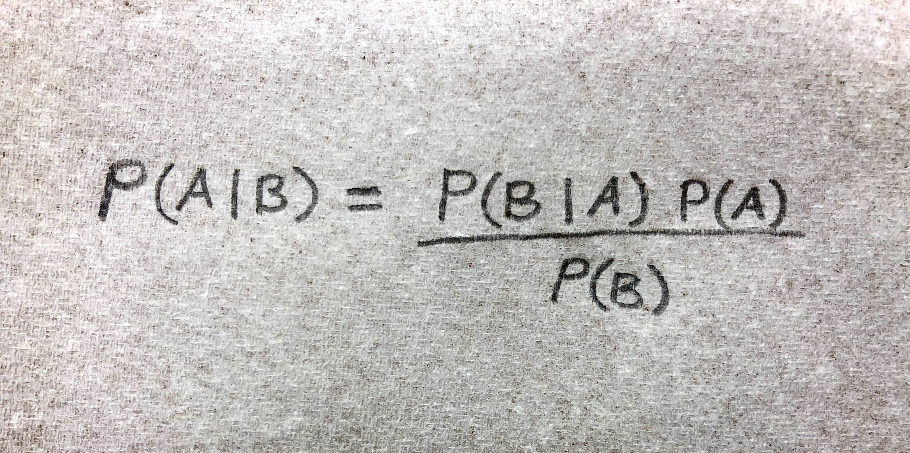

```{r setup, include=FALSE}
knitr::opts_chunk$set(echo = FALSE, out.width = '75%', fig.align = 'center')
library(ggplot2)
library(dplyr)
library(stringr)
library(knitr)
library(kableExtra)
library(printr)
load('../../../rdata/muilla_and_associates.Rdata')
```

```{r functions, include=FALSE}
ev_beta <- function (a1, a2) { a1 / (a1 + a2) }
credint_beta <- function (a1, a2, interval = 0.95) {
  tail.size <- (1 - interval) / 2
  lower <- qbeta(tail.size, a1, a2, lower.tail = TRUE)
  upper <- qbeta(tail.size, a1, a2, lower.tail = FALSE)
  return(c(lower, upper))
}
credint_beta_lower <- function (a1, a2, interval = 0.95) {
  tail.size <- (1 - interval) / 2
  return(qbeta(tail.size, a1, a2, lower.tail = TRUE))
}
credint_beta_upper <- function (a1, a2, interval = 0.95) {
  tail.size <- (1 - interval) / 2
  return(qbeta(tail.size, a1, a2, lower.tail = FALSE))
}
plot_beta <- function(a1, a2, interval = 0.95,
                      include.title = TRUE,
                      include.ev = TRUE,
                      include.ci = TRUE) {
  if ((a1 + a2) == 0) {
    include.ev <- FALSE
    include.ci <- FALSE
  }
  tail.size <- (1 - interval) / 2
  lower <- qbeta(tail.size, a1, a2, lower.tail = TRUE)
  upper <- qbeta(tail.size, a1, a2, lower.tail = FALSE)
  ev <- a1 / (a1 + a2)
  
  title.str <- paste0("PDF Beta(", round(a1, 3), ",", round(a2, 3), ")")
  subtitle.str <- str_c(100*interval, "% ", "Credible interval: [",
                             round(lower, 3), ", ", round(upper, 3), "]",
                             sep = "")
  plot <- ggplot(data.frame(x = c(0, 1)), aes(x)) +
    geom_area(stat = "function", fun = dbeta, args = list(shape1 = a1, shape2 = a2),
              fill = "grey", alpha = 0.5, xlim = c(lower, upper)) +
    stat_function(fun = dbeta, args = list(shape1 = a1, shape2 = a2)) +
    scale_y_continuous(limits = c(0, NA)) +
    labs(x = "probability", y = "density") +
    theme_bw()
  
  if (include.title) { plot <- plot + ggtitle(title.str) }

    if (include.ev) {
    title.str <- paste0(title.str, "; E=", round(ev,3))
    plot <- plot + 
      geom_vline(xintercept = ev, color = "blue") +
      ggtitle(title.str)
  }
  if (include.ci) {
    plot <- plot + ggtitle(title.str, subtitle = subtitle.str)
  }
  return(plot)
}
```

```{r coin_options}
throws <- 10
heads <- 8
tails <- throws - heads
coin_prior <- 100
```

## Fitting Bayes on a Napkin
Examples of Bayesian inference that are intuitive and so easy that they fit on a napkin are rare. However, estimating the probability of an event, given some data, can be that easy. And it provides an clear example of the role of prior beliefs (i.e. *priors*) in Bayesian inference.

## Modeling probabilities
We are often interested in estimating the probability that an event will occur--a *success* henceforth--based on limited data. A Bayesian method using beta distributions is particularly useful for this, as predictions are easy to calculate by hand and model parameters are few (only 2) and have intuitive, real-world interpretations. In the following sections, we'll introduce the beta distribution for probabilities, discuss the selection of appropriate priors, and work through examples. The examples begin with simple, non-conditional coin tossing and then move to the conditional probabilities of species co-occurance in ecology.

### The beta distribution
In Bayesian inference, we consider our belief about a thing to be distributed over some range of possibilities. For example, I believe the probability of heads in a coin toss is most likely around 50%, but it might be little more or less. We can model the distribution of that belief as a beta distribution, illustrated by the probability density function below.

```{r fig.align='center'}
plot_beta(coin_prior,coin_prior)
```

Note that the range of the beta distribution is bounded between zero and one, just like probabilities. The *x*-axis represents the probability we are estimating and the *y*-axis represents how likely any given probability is. The probability (*x*-axis) corresponding to the peak of the curve is the value we think most likely, i.e. the distribution's mode. The shape of the beta distribution depends on two shape parameters, $\alpha_1$ and $\alpha_2$. For the distribution above, their values are 100 and 100.

We can interpret the parameter $\alpha_1$ as the number of successes (heads) and $\alpha_2$ as the number of failures (tails) that we know of. The total weight of evidence supporting our belief is the sum $\alpha_1 + \alpha_2$. The weight of evidence affects the variance of the distribution, which represents our (lack of) confidence. High variance (wide spread) means low confidence, low variance means high confidence.

We can calculate the expected value of a beta distribution with a simple formula.

$$
\mathbf{E} = \frac{\alpha_1}{\alpha_1 + \alpha_2}.
$$

```{r, out.width=400, fig.cap="I told you it fits on a napkin."}
# 
```

So I estimate that the probability of heads is 0.5 (the expected value of the distribution) and I'm 95% sure that the actual probability is between 0.431 and 0.569, the bounds of the shaded 95% *credible interval* in the plot above. This intuitive interpretation of the credible interval is exactly what many people mistakenly believe that a frequentist confidence interval means.

## Priors
If we take this distribution as a prior, it will have the *weight* of evidence of having seen 200 coin flips, of which 100 were heads. Now if I see you flip a coin and get `r heads` heads and `r tails` tails, I should modify my belief to account for the new data. My posterior belief is distributed as
Beta(`r coin_prior` + `r heads`, `r coin_prior` + `r tails`). The fact that my prior is in the same form as my posterior (i.e. a beta distribution) means that it is a congugate prior, which can be very convenient but is not necessary.

The posterior distribution is shown below, with the prior overlaid as a dotted line so we can see the result of the update of our beliefs. We didn't change much, because our new evidence was a scant `r heads + tails` tosses compared to the weight of our prior, which was based on observing 200 tosses. This is consistent with our intuition that if someone pulls out a normal looking coin and tosses a few heads in a row, that's not enough evidence for us to decide that the game must be rigged.

```{r fig.align='center', fig.cap="Posterior distribution after seeing 8 heads and 2 tails"}
plot_beta(coin_prior + heads, coin_prior + tails) +
  stat_function(fun = dbeta, args = list(shape1 = 100, shape2 = 100),
                linetype = "dashed", color = "dark gray")
```

The choice of a particular prior should be deliberate. Informative priors are a powerful tool for making the most of data that is limited and difficult to obtain. Simply put, they can result in more accurate inference when used properly.

### Noninformative priors
> ... a "noninformative" prior does not necessarily refer to a flat or a uniform prior, but to a distribution that lets the likelihood play a major role in forming the posterior distribution [@Kerman:2011gp].

"Noninformative" priors minimize the risk that prior information is misleading for some reason. But the term "noninformative" is misleading, because prior assumptions always underly an analysis (equally true for frequentist methods) and even priors that aren't supposed to influence the results can do so. Our prior for the coin was strongly informative, because it had a lot more weight of evidence than our new observations (200 cf 10). In the following sections, we'll see how our posterior belief in the probability of heads would differ using a selection of standard weakly informative (a.k.a. "noninformative") priors.

#### Haldane's prior of Beta(0, 0)
The improper^[An improper prior does not integrate to one, and the integral may not even be finite. Oddly, this is sometimes ok.] Haldane prior represents the prior belief that we know nothing but the new data we've just seen, the philosophy underlying fequentist estimation. It has no expected value, as the formula would require dividing by zero. It results in a posterior with expected value equal to the maximum likelihood estimate (i.e. the sample mean) and so is the most prone to pulling posteriors toward the extremes when the proportion of successes in the sample is small or large. It also results in improper posteriors (sum of probabilities not equal to one) when either all or none of the samples result in success. The Haldane prior and resulting posterior distribution of belief, distributed as Beta(0 + `r heads`, 0 + `r tails`), are shown below.

```{r}
plot_beta(0,0)
plot_beta(0 + heads, 0 + tails)
```

#### Kerman's Neutral prior Beta(1/3, 1/3)
Our posterior is now Beta(1/3 + `r heads`, 1/3 + `r tails`). This prior has the attractive property that rather than shrinking posterior quantiles toward the extremes or the center as other "uninformative" priors, it results in posteriors with a 50% chance that the true value is either larger or smaller than the expected value. This is especially relevant for small samples and cases where the true probability of success is near 0 or 1 [@Kerman:2011gp].

```{r}
plot_beta(1/3, 1/3)
plot_beta(1/3 + heads, 1/3 + tails)
```

#### Jeffreys prior Beta(1/2, 1/2)
Jeffreys prior is another popular option. It has the attractive property that it is invariant under reparameterization of the distribution, but we have no interest in reparameterizing our beta distributions here. When the proportion of successes in the sample is small or large, Jeffreys prior tends to bias posterior quantiles toward the center. Our posterior under Jeffreys prior is Beta(1/2 + `r heads`, 1/2 + `r tails`).

```{r}
plot_beta(0.5, 0.5)
plot_beta(0.5 + heads, 0.5 + tails)
```

#### Bayes-Laplace uniform prior Beta(1, 1)
The Bayes-Laplace uniform prior has equal density over all possible values. Such a uniform prior is the unstated assumption of frequentists. It results in infered parameters that maximize the probability of the observed data under the prior assumption that all values are equally likely, i.e. a [maximum likelihood estimator](https://en.wikipedia.org/wiki/Maximum_likelihood_estimation). Even more than Jeffreys prior, it biases posteriors toward the center when the proportion of successes in the sample is small or large. Our posterior with the uniform prior is Beta(1 + `r heads`, 1 + `r tails`).

```{r}
plot_beta(1, 1)
plot_beta(1 + heads, 1 + tails)
```


## Estimating conditional probabilities
Plants are more interesting than coin tosses. This section demonstrates how our method can be applied to predicting the presence of one species of plant by the presence of another. This is useful when we're interested in locating particular plants, but the environmental variables underlying its distribution are imperceptible to us. We'll illustrate this example with data from botanical surveys in the vicinity of where a new species, *Muilla lordsburgana*, was recently discovered by [Patrick Alexander](http://www.polyploid.net). 

We'll consider three measures of an associated species's success as a binary predictor^[A binary predictor simply gives yes or no answers.] of *M lordsburgana*.

- Sensitivity is a measure of what proportion of our target species we'd find if we looked everywhere our predictor exists.
- Precision is a measure of what proportion of "yes" predictions will be correct.
- Accuracy is a measure what proportion of predictions (yes and no) will be correct.

From our survey data we create a contingency table of observation counts. The following contingency table is for target species S = *Muilla Lordsburgana* (MUILL) and associate A = *Pectocarya platycarpa* (PEPL). Recall that of the two beta parameters, $\alpha_1$ indicates successes and $\alpha_2$ indicates failures, though what constitutes a success and a failure depends on whether we're thinking of sensitivity, precision, or accuracy. We'll use the Neutral prior Beta(1/3, 1/3) and add the weight of evidence from the table to estimate the conditional probabilities of associate and target co-occurance.

```{r, include=TRUE}
priors.df <- tibble(prior = ordered(c("Haldane", "Neutral", "Jeffreys", "Uniform")),
                        x = 0.5,
                        a = c(0, 1/3, 1/2, 1))

ctbl <- with(muilla_and_associates.df, table(PEPL, MUILL))
kable(ctbl, "html") %>%
  group_rows("A", 1, 2) %>%
  add_header_above(c(" " = 1, "S" = 2)) %>%
  kable_styling(full_width = FALSE)
```

### The sample space
The term "sample space" refers to the whole world of possilibilites from the perspective of our analysis. Everything that could happen exists in the sample space. One key to understanding conditional probability is seeing how it constricts the sample space. In the contingency table above, the sample space consists of four mutually exclusive possibilities, based on the presence or absence of each species.

*Notation:* $\Pr(Y|X)$ means the probability that *Y* is true when *X* is true, a probability conditional on *X*.

#### Sensitivity P(A|S)
Sensitivity is the probability that the associate will be present when the target species is. A lack of sensitivity means that you'll miss a lot of your target species when relying on the associate as an indicator. The sample space is constricted to the right column, where S is always present. A success is when A is present, failure is the absence of A. Adding evidence from the table to our Neutral prior, our posterior belief in P(A|S) is Beta(1/3 + 12, 1/3 + 5).

```{r}
success <- ctbl[2,2]
failure <- ctbl[1,2]
kable(ctbl, "html") %>%
  group_rows("A", 1, 2) %>%
  add_header_above(c(" " = 1, "S" = 2)) %>%
  column_spec(3, background = "yellow") %>%
  kable_styling(full_width = FALSE)

plot_beta(1/3 + success, 1/3 + failure)

posteriors.df <- priors.df %>%
  select(-x) %>%
  mutate(p = ev_beta(a + success, a + failure),
         lower = credint_beta_lower(a + success, a + failure),
         upper = credint_beta_upper(a + success, a + failure))
```

##### Influence of prior on posterior of sensitivity
Our estimates of the probability P(A|S) are affected by our choice of prior, with *p* ranging from `r round(min(posteriors.df$p), 3)` to `r round(max(posteriors.df$p), 3)` and credible intervals varying over a similar range (see table below). The magnitude of the influence is largely a function of the ammount of new data we have. For sensitivity and precision, our sample space is constricted and only 17 of our 188 observations are relevant, so the proportion of prior weight in the posterior ranges from 0 to about 5.9%. For this particular analysis, the influence of prior is probably much less than that of other decisions, such as where to place geographic bounds on the sample data.

```{r warning=FALSE}
ggplot(tibble(x = 0:1), aes(x)) +
  stat_function(fun = dbeta, args = list(shape1 = 0 + success, shape2 = 0 + failure),
                aes(color = "Haldane")) +
  stat_function(fun = dbeta, args = list(shape1 = 1/3 + success, shape2 = 1/3 + failure),
                aes(color = "Neutral")) +
  stat_function(fun = dbeta, args = list(shape1 = 1/2 + success, shape2 = 1/2 + failure),
                aes(color = "Jeffreys")) +
  stat_function(fun = dbeta, args = list(shape1 = 1 + success, shape2 = 1 + failure),
                aes(color = "Uniform")) +
  scale_y_continuous(limits = c(0, NA)) +
  labs(x = "Probability", y = "Density", color = "Prior") +
  ggtitle("Posterior P(A|S) with standard 'uninformative' priors") +
  theme_bw()
```

For sensitivity P(A|S): priors, associated beta parameter *a*, point estimates for *p*, and lower and upper bounds of 95% credible intervals.
```{r}
posteriors.df %>%
  kable(format = "html", digits = 4) %>%
  kable_styling(full_width = TRUE)
```

#### Precision P(S|A)
Precision is the probability that the target species will be present when the associate is. The sample space is constricted to the bottom row where A is always present. Success is when S is also present, failure is the absence of S. Because our data contains identical numbers of observations where S was present and A absent, and visa versa, our estimates for the precision and sensitivity are identical and our posterior is again Beta(1/3 + 12, 1/3 + 5).

```{r}
success <- ctbl[2,2]
failure <- ctbl[2,1]
kable(ctbl, "html") %>%
  group_rows("A", 1, 2) %>%
  add_header_above(c(" " = 1, "S" = 2)) %>%
  row_spec(2, background = "yellow") %>%
  kable_styling(full_width = FALSE)

plot_beta(1/3 + success, 1/3 + failure)
```

##### Influence of prior on posterior of precision
Identical to our analysis of the posterior of sensitivity.

```{r warning=FALSE}
priors.df <- data_frame(prior = ordered(c("Haldane", "Neutral", "Jeffreys", "Uniform")),
                        x = 0.5,
                        a = c(0, 1/3, 1/2, 1))
ggplot(data_frame(x = 0:1), aes(x)) +
  stat_function(fun = dbeta, args = list(shape1 = 0 + success, shape2 = 0 + failure),
                aes(color = "Haldane")) +
  stat_function(fun = dbeta, args = list(shape1 = 1/3 + success, shape2 = 1/3 + failure),
                aes(color = "Neutral")) +
  stat_function(fun = dbeta, args = list(shape1 = 1/2 + success, shape2 = 1/2 + failure),
                aes(color = "Jeffreys")) +
  stat_function(fun = dbeta, args = list(shape1 = 1 + success, shape2 = 1 + failure),
                aes(color = "Uniform")) +
  scale_y_continuous(limits = c(0, NA)) +
  labs(x = "Probability", y = "Density", color = "Prior") +
  ggtitle("Posterior P(S|A) with standard 'uninformative' priors") +
  theme_bw()

```

For precision P(S|A): priors, associated beta parameter *a*, point estimates for *p*, and lower and upper bounds of 95% credible intervals.
```{r}
priors.df %>%
  select(-x) %>%
  mutate(p = ev_beta(a + success, a + failure),
         lower = credint_beta_lower(a + success, a + failure),
         upper = credint_beta_upper(a + success, a + failure)) %>%
  kable(format = "html", digits = 4) %>%
  kable_styling(full_width = TRUE)
```

#### Accuracy P(S,A OR !S,!A)
Accuracy is the probability that the associate will be correct as a binary predictor, i.e. that the target species will be present when the associate is present and absent when the associate is absent. So we define success as an observation where both or neither were present. Because *both* and *neither* are mutually exclusive, we can use the addition rule of probability and express accuracy as
$$
\Pr(S,A \mathrm{~OR~} !S,!A) = \Pr(S,A) + \Pr(!S,!A)
$$

And so we simply add our observed success and failures from the contingency table to our beta prior as before. The sample space is not constricted, because accuracy considers all possible outcomes. Successes are the top left corner (!S, !A) and the bottom right corner (S, A). Failures are in the other diagional. Our posterior belief in the accuracy of this predictor is distributed as Beta(1/3 + 12 + 166, 1/3 + 5 + 5).

```{r}
success <- ctbl[2,2] + ctbl[1,1]
failure <- ctbl[2,1] + ctbl[1,2]
kable(ctbl, "html") %>%
  group_rows("A", 1, 2) %>%
  add_header_above(c(" " = 1, "S" = 2)) %>%
  kable_styling(full_width = FALSE)

plot_beta(1/3 + success, 1/3 + failure)
```

##### Effect of sample size on confidence
We see that the posterior distribution for accuracy is much narrower than that for sensitivity and precision. This is a function of the additional weight of evidence in support of our posterior for accuracy. We have 188 observations relevant to accuracy, and only 17 relevant to sensitivity and precision. The widths of the credible intervals are 41% with 17 observations and 6% with 188, clearly illustrating how confidence changes as a function of sample size.

##### Influence of prior on posterior of accuracy
Our posterior belief in the accuracy of A as a predictor of S is less affected by choice of prior than were sensitivity and precision. The reason for the difference is that the additional weight of evidence (188 cf 17 observations) overwhelmed the differences between priors.

```{r warning=FALSE}
priors.df <- data_frame(prior = ordered(c("Haldane", "Neutral", "Jeffreys", "Uniform")),
                        x = 0.5,
                        a = c(0, 1/3, 1/2, 1))
ggplot(data_frame(x = 0:1), aes(x)) +
  stat_function(fun = dbeta, args = list(shape1 = 0 + success, shape2 = 0 + failure),
                aes(color = "Haldane")) +
  stat_function(fun = dbeta, args = list(shape1 = 1/3 + success, shape2 = 1/3 + failure),
                aes(color = "Neutral")) +
  stat_function(fun = dbeta, args = list(shape1 = 1/2 + success, shape2 = 1/2 + failure),
                aes(color = "Jeffreys")) +
  stat_function(fun = dbeta, args = list(shape1 = 1 + success, shape2 = 1 + failure),
                aes(color = "Uniform")) +
  scale_y_continuous(limits = c(0, NA)) +
  ggtitle("Posterior P(A,S or !A,!S) with standard 'uninformative' priors") +
  labs(x = "Probability", y = "Density", color = "Prior") +
  theme_bw()
```

For accuracy P(S,A) + P(!S,!A): priors, associated beta parameter *a*, point estimates for *p*, and lower and upper bounds of 95% credible intervals.
```{r}
# Note: could use credint_beta if input to mutate were through rowwise(.)
priors.df %>%
  select(-x) %>%
  mutate(p = ev_beta(a + success, a + failure),
         lower = credint_beta_lower(a + success, a + failure),
         upper = credint_beta_upper(a + success, a + failure)) %>%
  kable(format = "html", digits = 4) %>%
  kable_styling(full_width = TRUE)
```

## Summary
Our beliefs can be represented as a distribution over possibilities. The expected value of the distribution is our best point-estimate and the variance indicates our (lack of) confidence. In the case of a belief in a probability, the evidence supporting our belief is convieniently represented as the two parameters of a beta distribution. Arriving at a posterior belief after considering new evidence is as simple as adding the new evidence to the old in the form of the beta parameters. The expected value (point-estimate) is easily calculated as $\frac{\alpha_1}{\alpha_1 + \alpha_2}$. Credible intervals are a little more complicated, but are simply the symetric quantiles of the distribution that bound the desired interval, trivial to calculate with free software like R.

Choice of prior should be deliberate, particularly whether to use a prior that's more than weakly informative. Informative priors can be especially useful when new data is limited and difficult to obtain. However, for the assortment of commonly used "uninformative" priors, a reasonable sample size will render differences in posteriors relatively minor.

## References 
